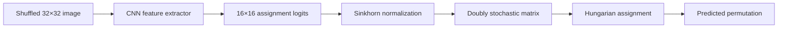

# CNN Jigsaw Solver

A convolutional neural network that recovers the correct arrangement of shuffled image patches in a 32×32 grayscale jigsaw puzzle. The model predicts a global permutation over sixteen 8×8 tiles and is implemented entirely from scratch on the GPU with CuPy, without PyTorch or TensorFlow.

## Problem

Each training example is a 32×32 grayscale image divided into a fixed **4×4 grid** of **8×8 patches**. The patches are permuted at random to form a shuffled image. The learning target is the permutation that maps each **display position** (where a patch appears in the shuffled image) back to its **original patch index** before shuffling.

The task is therefore a **16-way assignment problem**: every display slot must be matched to exactly one source patch, and every source patch must appear exactly once. This is stricter than predicting sixteen independent labels, because invalid permutations (two slots claiming the same patch) must be ruled out.

Evaluation uses **reconstruction accuracy**: the fraction of non-empty patches (pixel values above a small threshold) for which the predicted assignment matches the ground truth. Empty or near-black patches are excluded so that uniform regions do not dominate the score.

## Approach

The network maps the shuffled image to a **16×16 matrix** of assignment scores. **Sinkhorn iterations** turn this matrix into a doubly stochastic approximation (non-negative entries; each row and column sums to one), which encodes a soft permutation. At inference time, the **Hungarian algorithm** selects the hard one-to-one assignment that maximizes the total score.

## Model

`JigsawCNN` follows a VGG-style stack of convolutional blocks:

| Stage | Structure |
|-------|-----------|
| Block 1 | Conv 1→64, Mish, Conv 64→64, Mish, max pool 2×2 |
| Block 2 | Conv 64→128, Mish, Conv 128→128, Mish, max pool 2×2 |
| Block 3 | Conv 128→256 (×3), Mish between layers, max pool 2×2 |
| Block 4 | Conv 256→512 (×3), Mish between layers (no pool) |

The spatial map is flattened and passed through a linear layer to **256 outputs**, reshaped to **16×16 logits**. A **Sinkhorn layer** (20 iterations, temperature 1.0) produces the final assignment matrix. Activations use **Mish** throughout the convolutional stack.

Convolution and pooling layers use an **im2col** formulation with explicit forward and backward passes. All core array operations run on the GPU via CuPy.

## Training

- **Data**: images from `acv_train_32x32`, with an 80/20 train/validation split created on first use and stored in `datasets/split.json`. Each epoch applies a fresh random shuffle of the sixteen patches.
- **Loss**: cross-entropy between the Sinkhorn output and a one-hot target assignment matrix (`CrossEntropyLossSinkhorn`), averaged over batch and tile dimension.
- **Optimizer**: stochastic gradient descent with a fixed learning rate.
- **Typical settings** (see `src/training/train.py`): batch size 2048, learning rate 1×10⁻², 200 epochs. Validation reconstruction accuracy is reported every five epochs.

The network learns to assign patches from **global image context** rather than from pairwise edge matching between neighbors, which is the approach used in classical jigsaw solvers.

## Inference

For each test image, the trained network outputs a 16×16 score matrix. The cost matrix passed to assignment is the negative of these scores; `scipy.optimize.linear_sum_assignment` returns the optimal permutation. Predictions are emitted as a comma-separated list of sixteen integers per image (filename followed by assignments).

## Implementation

This repository is a **from-scratch deep learning exercise**: convolutions, Mish, max pooling, linear layers, Sinkhorn, and the training loop are implemented directly. Gradients are computed manually and parameters are updated with a small custom SGD helper.

| Path | Role |
|------|------|
| `src/config.py` | Image size (32×32), grid (4×4), patch size (8×8), tile count (16) |
| `src/cnn/layers.py` | Layer primitives, Sinkhorn, loss |
| `src/cnn/model.py` | `JigsawCNN` architecture |
| `src/cnn/optim.py` | SGD optimizer |
| `src/training/data.py` | Dataset, shuffling, data loader |
| `src/training/train.py` | Training loop |
| `src/training/utils.py` | State dict I/O, Hungarian assignment, accuracy metric |
| `test.py` | Inference over a directory of PNG test images |

A trained weight checkpoint is stored as `final.pkl` (pickled state dict).

## Scope and limitations

- Fixed resolution (**32×32**), fixed grid (**4×4**), **grayscale** only.
- Global permutation via a single 16×16 assignment; no iterative assembly or pairwise compatibility model.
- Performance depends on visual structure in the patches; uniform or ambiguous regions are harder to place correctly.
- The metric deliberately skips near-empty patches, so accuracy reflects informative tiles rather than blank background.